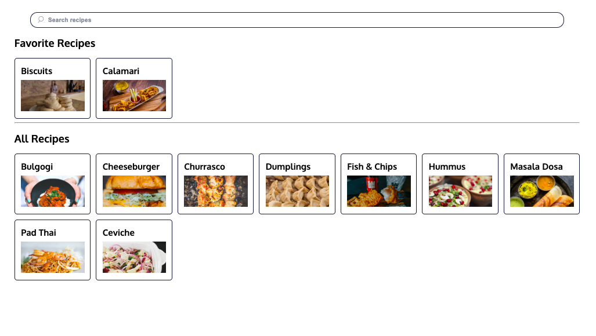

# Recipes (Redux)

## Table of contents

- [Overview](#overview)
  - [The challenge](#the-challenge)
  - [Screenshot](#screenshot)
  - [Links](#links)
- [My process](#my-process)
  - [Built with](#built-with)
  - [What I learned](#what-i-learned)
  - [Continued development](#continued-development)
- [Author](#author)

## Overview

### The challenge

Users should be able to:

- View the optimal layout for the app depending on their device's screen size.
- Search recipe list.
- Add recipes to favorite recipe section.
- Remove recipes from favorite recipe section.

### Screenshot

### Links

- Live Site URL: [View](https://recipesredux.netlify.app/)

## My process

- The `action.payload` property is used to hold additional data that the reducer might need to carry out a given action. The name `payload` is simply a convention, and its value can be anything!
- The spread syntax (`...`) and [array](https://www.codecademy.com/resources/docs/general/data-structures/array) methods such as .`map()`, `.slice()`, and `.filter()` can be used to immutably update the state of a complex app.
- _Reducer composition_ is a design pattern for managing a Redux store with multiple slices.
- The _root reducer_ delegates actions to slice reducers that are responsible for updating only their assigned slice of the store’s state. The root reducer then reassembles the slices into a new state object.
- `combineReducers()` is a [method](https://www.codecademy.com/resources/docs/general/method) provided by the `redux` library that accepts a collection of reducer functions and returns a `rootReducer` that implements the reducer composition pattern.
- In a Redux application, slice reducers are often written in separate files. This pattern is known as [Redux Ducks](https://github.com/erikras/ducks-modular-redux).

**Redux Toolkit**

- **R**edux **T**ool**k**it (RTK) contains packages and functions that build in suggested best practices, simplify most Redux tasks, prevent common mistakes, and make it easier to write Redux applications.
- RTK has a `createSlice()` function that will help us simplify our Redux reducer logic and actions.
- `createSlice()` has one [parameter](https://www.codecademy.com/resources/docs/general/parameter), a configuration object, which we call `options`. In this lesson, we covered three object properties: `name`, `initialState`, and `reducers`. The configuration object has more properties which will be covered in the following lessons.
- A case reducer is a [method](https://www.codecademy.com/resources/docs/general/method) that can update the state and will be executed when the corresponding action type is dispatched. This is similar to a case in a switch statement.
- You can write code that “mutates” the state inside the case reducers passed to `createSlice()`, and Immer will safely and accurately return an immutably updated state.
- `createSlice()` returns an object with the following properties: `name`, `reducer`, `actions`, and `caseReducers`.
- We typically use a Redux community code convention called the “ducks” pattern when exporting the action creators and the reducer.
- RTK has a `configureStore()` function that simplifies the store setup process. `configureStore()` wraps around the Redux core `createStore()` function and the `combineReducers()` function, and handles most of the store setup for us automatically.

### Built with

- Semantic HTML5 markup
- CSS custom properties
- Mobile-Responsive Design
- JavaScript - Scripting language
- [React](https://reactjs.org/) - JS library
- [Redux](https://redux.js.org/) - JS library

### What I learned

This was a class project to learn strategies for complex state of Redux and Redux Toolkit.

### Continued development

- Update the application to include a user profile slice to keep track of the favorite recipes.
- Add a new case reducer to handle adding user-created recipes.
- Add a rating system to recipes so the user can “rank” their favorite recipes.

## Author

- Website - [Cameron Howze](https://camkol.github.io/)
- Frontend Mentor - [@camkol](https://www.frontendmentor.io/profile/camkol)
- GitHub- [@camkol](https://github.com/camkol)
- LinkedIn - [@cameron-howze](https://www.linkedin.com/in/cameron-howze-28a646109/)
- E-Mail - [cameronhowze4@outlook.com](mailto:cameronhowze4@outlook.com)
